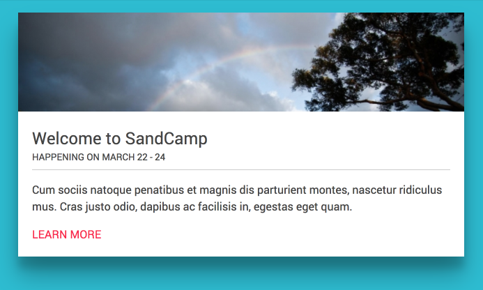

# Component Variations

### Presentation on how to create component variations without repeating yourself.

Component based development is one of the hottest trends in web development because they present so many advantages over the traditional web development approach.

One big advantage of components is, if they are built properly, they can be reused througout your website without repeating code.

## What are component variations
Component variations is the ability to take a pre-existing component and modify it without altering the original component.  Component variations is usually achieved by using *modifier css classes* which are used when a different look or behavior needs to be achived.

## Example of a component variation

Let's start with a pretty basic button component.
```html
  <a href="#" class="button">Learn More</a>
```

Here are the styles which will apply to any element with the class of `button`.
```scss
.button {
  background: #000;
  border: 0;
  border-radius: 2px 2px 2px 2px;
  box-shadow: none;
  color: white;
  cursor: pointer;
  display: inline-block;
  font-family: Verdana, sans-serif;
  font-size: 16px;
  font-weight: lighter;
  letter-spacing: 2px;
  padding: 18px 50px;
  text-align: center;
  text-transform: uppercase;
}
```


---

## Creating variations

Now, without affecting the original button above, we will create two new variations in which we will change the background color of the button.  We will use the css classes `button--secondary` and `button--tertiary` to achive the new variation.  These new classes are appended to the original class of `button`

### Secondary button
```html
<a href="#" class="button button--secondary">Learn More</a>
```

```scss
.button--secondary {
  background: #c0392b;
}
```


---

### Tertiary button
```
<a href="#" class="button button--tertiary">Learn More</a>
```
```
.button--tertiary {
  background: #2980b9;
}
```


Pretty cool huh? :metal:

---

Each of the examples above starts by using the default class of `button` to inherit all base button styles.  Whenever we want to use a different color button we append the class `button--secondary` or `button--tertiary` which overrides the original background color property and assigns a new color.  All other original button styles remain unchaged.

## More advanced variations
Now that we have a basic concept on variations, let's create a more advanced example.  This time we will start by creating a Card component which contains the following attributes:
* Image
* Title
* Date
* Teaser text
* Link

This is how our default card looks like


This is the markup and styles for our card:

**Markup**
```html
<div class="card">
  <div class="card__media">
      
  </div>

  <div class="card__text">
    <h2 class="card__text--title">Welcome to SandCamp</h2>
    <p class="card__text--teaser">Cum sociis natoque penatibus et magnis dis parturient montes, nascetur ridiculus mus. Cras justo odio, dapibus ac facilisis in, egestas eget quam.</p>
    <a href="#" class="card__cta">Learn more</a>
  </div>
</div>
```

**Styles**
```scss
@import url(https://fonts.googleapis.com/css?family=Roboto:400,700,300);

* {
  box-sizing: border-box;
}

body {
  font-family: 'Roboto', 'Verdana', sans-serif;
  font-size: 16px;
  line-height: 1.5;
  background: #00BCD4;
  color: #444;
}

a {
  color: #FF1744;
  text-decoration: none;
  text-transform: uppercase;
}

img {
  max-width: 100%;
  height: auto;
  display: block;
}

.card {
  position: relative;
  max-width: 640px;
  background: #fff;
  margin: 40px auto;
  border-radius: 2px;
  box-shadow: 0 27px 55px 0 rgba(0, 0, 0, 0.3), 0 17px 17px 0 rgba(0, 0, 0, 0.15);
}

.card__text {
  padding: 20px;
  left: 0;
  right: 0;
  bottom: 0;
}

.card__text--title {
  margin: 0;
  font-size: 24px;
  font-weight: 400;
}
```

## Creating variations
Now using the original markup and styles we will create the following two card variations

**Card Medium**



**Card Small**


### Updating Markup
To create the new variations, we need to update our markup by appending the classes `card--medium` and `card--small` to the existing `card` class.
Our new card markup should look like this:

```html
<div class="card card--medium card--small">
   ...
</div>
```

So we are adding two new modifier classes to our original Card component and we will use those modifier classes in our CSS styles to create the different variations.

Our styles now should look like this:

```scss
  @import url(https://fonts.googleapis.com/css?family=Roboto:400,700,300);

* {
  box-sizing: border-box;
}

body {
  font-family: 'Roboto', 'Verdana', sans-serif;
  font-size: 16px;
  line-height: 1.5;
  background: #00BCD4;
  color: #444;
}

a {
  color: #FF1744;
  text-decoration: none;
  text-transform: uppercase;
}

img {
  max-width: 100%;
  height: auto;
  display: block;
  
  .card--small & {
    height: 120px;
  }
}

.card {
  position: relative;
  max-width: 640px;
  margin: 20px auto;
  border-radius: 2px;
  box-shadow: 0 27px 55px 0 rgba(0, 0, 0, 0.3), 0 17px 17px 0 rgba(0, 0, 0, 0.15);

  // Reduces image max-width.
  &.card--small {
    max-width: 400px;
  }
}

.card__text {
  padding: 20px;
  left: 0;
  right: 0;
  bottom: 0;
  background: #fff;
  
  // Moves text wrapper within image.
  .card--medium & {
    position: absolute;
    bottom: 0;
    left: 0;
    right: 0;
  }
  
  .card--small & {
    top: 0;
    left: 100px;
    .card__text--teaser {
      display: none;
    }
  }
}

.card__text--title {
  margin: 0;
  font-size: 24px;
  font-weight: 400;
  
  .card--small & {
    font-size: 22px;
  }
}

.card__text--date {
  text-transform: uppercase;
  display: block;
  border-bottom: 1px solid #ccc;
  padding-bottom: 8px;
  margin-bottom: 5px;
}
```
In the code above you will noticed several of the original CSS rules now contain one of the two new classes we added to our markup (`card--medium` or `card--small`).  You will also noticed these classes have an **ampersand (`&`)** before the class or after the class.  The ampersand can be used to reference sibling selectors or to add a parent selector to a rule.  Read more about [referencing parent selectors by using ampersand](http://thesassway.com/intermediate/referencing-parent-selectors-using-ampersand).

With a combination of new modifier classes and the handy ampersand, we can create pretty crazy variations of our component.

**NOTE**:  The ampersand is not required, but it's a handy way for writing cleaner Sass code.


